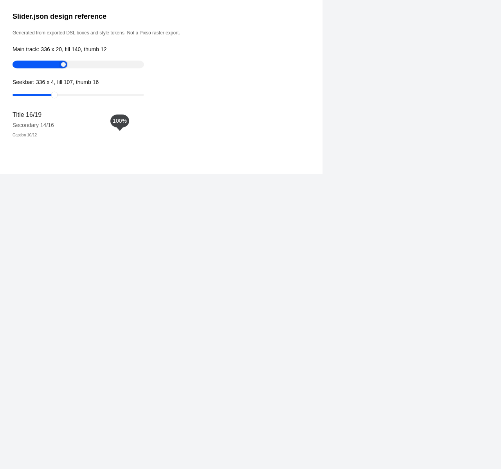
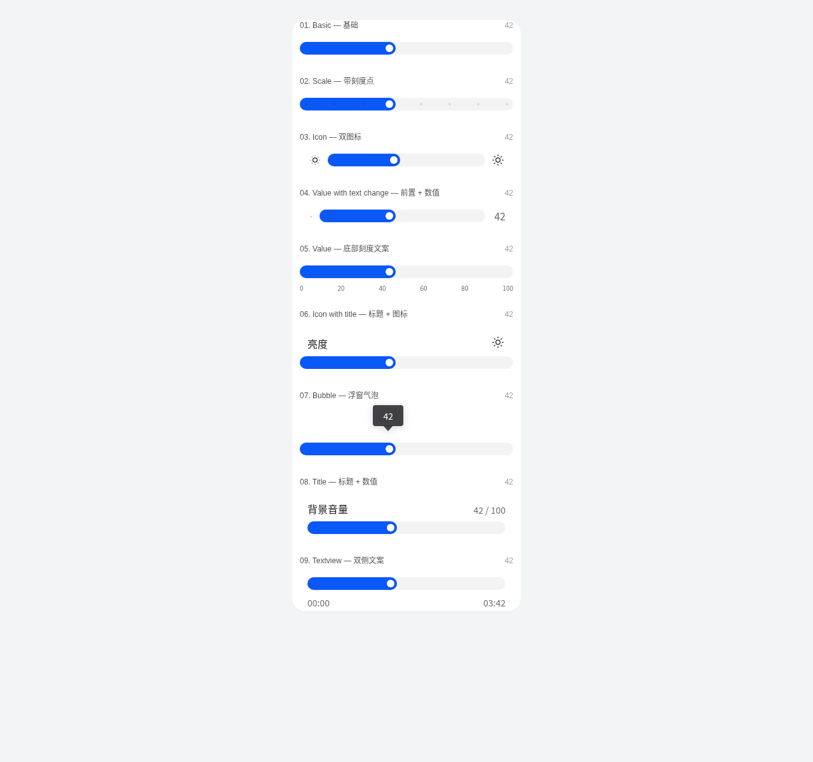
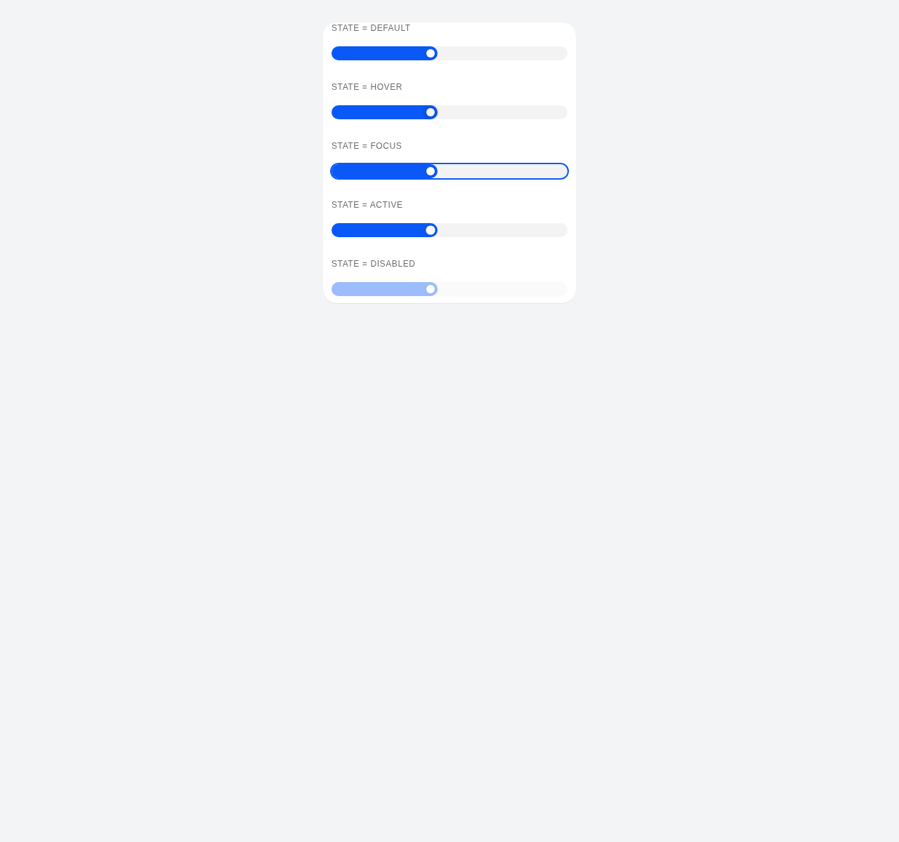
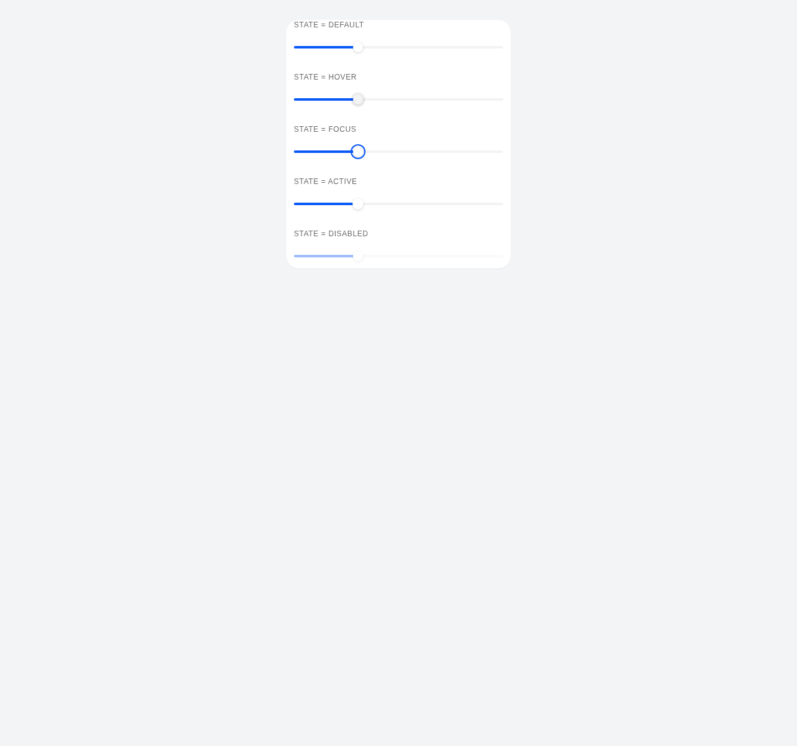

# Slider 设计稿规范验证报告

验证对象：`src/component/Slider`

设计稿来源：`src/verification/Slider.json`

评分标准：`src/verification/reference.md`

## 结论

总分：**83.8/100**，结论：**基本符合，存在可修复偏差**。

- 资源调用：10/20
- 样式 CSS 比对：53.8/60
- 变体属性：20/20

## 截图

设计参考图（由 JSON box/style 生成，非 Pixso 原始 raster）：

Storybook AllTypes：

Storybook AllStates：

Storybook SeekbarStates：

## 主要问题

- **high**：气泡框样式与设计稿不一致。设计稿气泡为 48x33、圆角 18px、文本 “100%”、无阴影；Storybook 采集为 48x33、圆角 4px、文本 “42”、filter=drop-shadow(rgba(0, 0, 0, 0.18) 0px 2px 6px)。 修复建议：将 `.pixso-slider__bubble-body` 圆角改为 18px，去掉额外 drop-shadow；如果该 Story 要按设计样例截图做比对，bubbleFormatter/default value 应展示 100%。
- **medium**：图标资源未使用设计稿 HM Symbol 图标字体。设计稿 icon font=HM Symbol，Storybook icon font="HarmonyOS Sans", "PingFang SC", "Microsoft YaHei", system-ui, -apple-system, sans-serif。 修复建议：将 Slider icon story/默认资源切换为规范图标库，或在组件 props 文档中标明需传入 HM Symbol/Pixso 资源。
- **medium**：阴影 token 有偏差。设计稿 thumb shadow=0 0 3 rgba(0,0,0,.2)，组件 CSS 采集=rgba(0, 0, 0, 0.12) 0px 1px 4px 0px。 修复建议：将 `--pixso-thumb-shadow` 对齐为 0 0 3px rgba(0,0,0,.2)，seekbar 同步处理。
- **low**：部分 alpha 使用 0.047 近似 0.05。设计稿 tertiary/hover alpha=.05，组件采集 track bg=rgba(0, 0, 0, 0.047)。 修复建议：如需像素级对齐，改为 rgba(0,0,0,0.05)。

## 说明性观察

- 主 Slider fill 长度未计入评分。设计导出样例 fill=140px、thumb 中心约 38.7/100；Storybook value=42 对应 fill=151.11px、推回约 42/100。 说明：该差异来自设计样例值与 Story 默认 value 不一致，不能直接证明组件进度换算规则错误。若要像素级比对，应先把 Story 默认值调到设计样例对应值。

## 关键样式 Diff

- PASS main slider width: expected=360, actual=360
- PASS main row height: expected=40, actual=40
- PASS main row padding left: expected=12, actual=12
- PASS main row padding top: expected=10, actual=10
- PASS main track height: expected=20, actual=20
- FAIL main track bg: expected=rgba(0, 0, 0, 0.05), actual=rgba(0, 0, 0, 0.047)
- PASS main thumb diameter: expected=12, actual=12
- PASS main fill color: expected=rgb(10, 89, 247), actual=rgb(10, 89, 247)
- PASS main thumb color: expected=rgb(255, 255, 255), actual=rgb(255, 255, 255)
- PASS seekbar width: expected=360, actual=360
- PASS seekbar horizontal padding: expected=12, actual=12
- PASS seekbar track width: expected=336, actual=336
- PASS seekbar track height: expected=4, actual=4
- PASS seekbar fill width at story value: expected=107, actual=107.52
- PASS seekbar thumb diameter: expected=16, actual=16
- PASS seekbar fill color: expected=rgb(10, 89, 247), actual=rgb(10, 89, 247)
- PASS hover state present: expected=true, actual=true
- PASS focus state present: expected=true, actual=true
- PASS disabled state present: expected=true, actual=true
- PASS focus ring color: expected=rgb(10, 89, 247), actual=rgb(10, 89, 247)
- PASS disabled opacity: expected=0.4, actual=0.4
- PASS bubble body width: expected=48, actual=48
- PASS bubble body height: expected=33, actual=33
- PASS bubble body bg: expected=rgba(46, 48, 51, 0.9), actual=rgba(46, 48, 51, 0.9)
- FAIL bubble body radius: expected=18px, actual=4px
- PASS bubble text color: expected=rgb(255, 255, 255), actual=rgb(255, 255, 255)
- PASS bubble text size: expected=14px, actual=14px
- PASS bubble text line-height: expected=16px, actual=16px
- FAIL bubble text content: expected=100%, actual=42
- PASS bubble arrow width: expected=8px, actual=8px
- PASS bubble arrow height: expected=9px, actual=9px
- PASS bubble arrow color: expected=rgba(46, 48, 51, 0.9), actual=rgba(46, 48, 51, 0.9)
- FAIL bubble shadow: expected=none, actual=drop-shadow(rgba(0, 0, 0, 0.18) 0px 2px 6px)

## 变体覆盖

- PASS variant basic
- PASS variant scale
- PASS variant icon
- PASS variant valueWithChange
- PASS variant value
- PASS variant iconWithTitle
- PASS variant bubble
- PASS variant title
- PASS variant textview

## 产出文件

- `design-extracted.json`：从 `Slider.json` 抽取的规范值
- `actual-styles.json`：Storybook DOM computed style 采集结果
- `style-diff.json`：样式/资源/变体比对结果
- `screenshots/*.png`：设计参考图和 Storybook 截图
