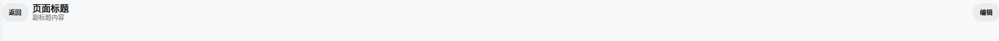
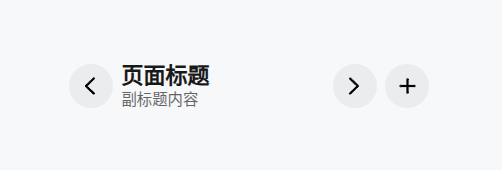
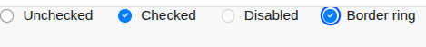
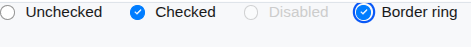
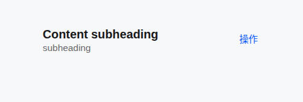
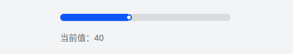
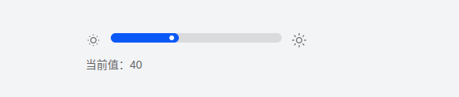

+ 状态栏/Statusbar
   + 个人打分 8/10
   +   | 存在问题 | 解决方案 |
       | ---- | ---- |
       | 示例组件右边是一个整体icon图片,不好定制化单个icon| 建议icon设置为可以传入单个的图标 |
+ 标题栏/TitleBar
  + 个人打分 7/10
  + | 存在问题 | 解决方案 |
    | ---- | ---- |
    |设计稿整体有一个上下的7px的边距，设计稿没有 | 给最外层加上上下7px的边距|
    |整体宽度设置为100%，建议和Statusbar保持一致|宽度设为328px|
    |icon里的文字字号、字重、行高不对|文字字号、字重、行高改为设计稿对应|
    |中间的title-bar__title的行高设计稿是23,设计组件是20|title-bar__title的行高改为23|
    |中间的title-bar__subtitle的行高设计稿是16,设计组件是14|title-bar__subtitle的行高改为16|
  + 改前效果：
  + 改后效果：
+ 勾选/checkbox
  + 个人打分 9/10
  + | 存在问题 | 解决方案 |
    | ---- | ---- |
    | 禁用状态的顔色未设置区分|禁用状态的字体设置不同的颜色|
  + 改前效果：
  + 改后效果：
+ List/列表
  + 个人打分7/10
  +  | 存在问题 | 解决方案 |
     | ---- | ---- |
     |list-item__title 设计稿行高是19,设计组件行高是22|list-item__title行高改为19|
     |list-item__subtitle-row设计稿行高是16,设计组件行高是20|list-item__subtitle-row行高改为16|
     |变体完整度不全，左边部分的图标未留出资源位置，而是固定给一个div,且宽高固定|建议图标部分可以传入图标|
     |列表项右边的文字行高设计稿是16px,设计组件是20px|设计组件右边的文字行高改为16px|
     |右边部分文字和图标的间距设计稿是4px,设计组件是8px|文字和图标的间距改为4px|
  + 改前效果：
  + 改后效果：
+ AiBottomBar
  + 个人打分10/10
+ 子标题/subheader
  + 个人打分7/10
  + | 存在问题 | 解决方案 |
    | ---- | ---- |
    |主标题设计稿行高是固定的21px,设计组件是1.2|设计组件主标题行高改为21px|
    |副标题设计稿行高是固定的16px,设计组件是1.25|设计组件副标题行高改为16px|
    |右边操作区行高设计组件是16px,设计组件是1.25|设计组件行高改为16px|
    |按钮类型subHeader文字行高设计稿是19px,设计组件是1.2|按钮类型subHeader行高改为19px|
    |右边图标文字行高设计稿为16px,设计组件为1.25|设计组件行高改为16px|
    |my-subheader__aside--more上边距和左边不一致，整体有点偏下|my-subheader__aside--more上边距调整和左边一样|
  + 改前效果：
  + 改后效果：
+ 滑动条/slider
  + 个人打分 6/10
  + | 存在问题 | 解决方案 |
    | ---- | ---- |
    |选中步长值右边效果和设计稿不一致，设计稿右边是圆弧，且圆球在弧度里面|调整代码逻辑，使右边部分和设计稿保持一致|
  + 改前效果：
  + 改后效果：
+ 卡片/Card
  + 个人打分10/10
+ PixsoSlider
  + 个人打分10/10
+ SceneModeCard
  + 个人打分 7/10
  + | 存在问题 | 解决方案 |
    | ---- | ---- |
    |图标的位置采用相对定位，和文字的位置间距无法保证|建议采用padding的写法，不采用相对定位，保证图标和文字的间距固定|
    |"免打扰"文字的字重和“减少打扰保持专注"的字重搞翻了|调整两部分文字的字重|
    |"免打扰"文字和”减少打扰保持专注"缺少间距|这两个部分加上2px的间距|
    |缺少立即开启按钮控件|加上立即开启按钮控件|

